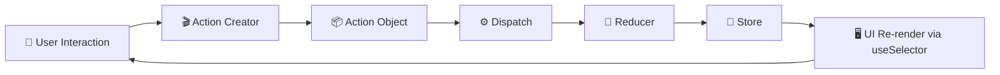
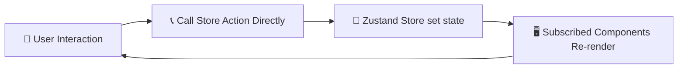
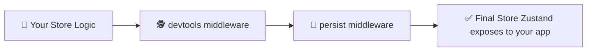
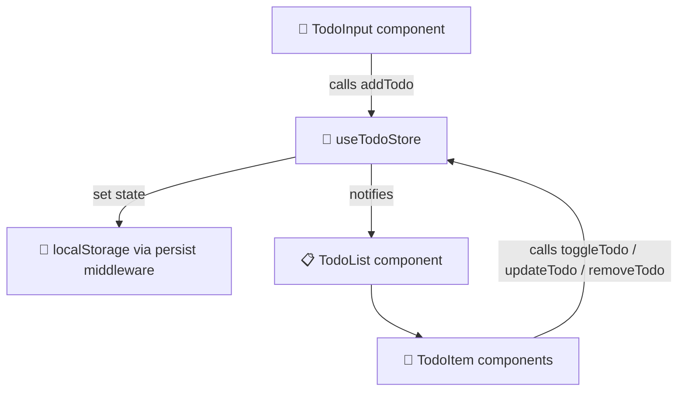

<!-- Banner (replace with your image if available) -->
<p align="center">
  
</p>

<h1 align="center">🐻 Zustand — Simple, Fast, Scalable State Management</h1>

> ✅ _Author_: [Piyash Hasan](https://github.com/piyashhasan)  
> 📝 _Topic_: All About Zustand </br>
> 📅 _Published_: 04 July 2026

> A comprehensive documentation covering everything you need to know about Zustand, from basics to advanced concepts. 🚀

---

<div align="center">

</div>

## 📚 Table of Contents

1. [🎯 Why State Management Matters for Front-End Developers](#-why-state-management-matters-for-front-end-developers)
2. [🏭 Why Production-Grade Apps Need Redux / Zustand](#-why-production-grade-apps-need-redux--zustand)
3. [⚔️ Redux vs Zustand — Full Comparison](#️-redux-vs-zustand--full-comparison)
4. [🔄 How They Work — Architecture Diagrams](#-how-they-work--architecture-diagrams)
5. [🚀 Why Zustand Is More Popular Than Redux](#-why-zustand-is-more-popular-than-redux)
6. [✅ Why You Should Choose Zustand](#-why-you-should-choose-zustand)
7. [🛠️ Hands-On: Build a Todo App with Zustand](#️-hands-on-build-a-todo-app-with-zustand)
8. [📦 Installation](#-installation)
9. [💡 Best Practices](#-best-practices)
10. [📎 Resources](#-resources)

---

## 🎯 Why State Management Matters for Front-End Developers

As applications grow beyond a handful of components, **state** — the data that drives what the UI shows — becomes the hardest thing to reason about, not the UI itself.

> 🧠 **Core truth:** UI is just a function of state. `UI = f(state)`. If state is messy, your UI becomes unpredictable.

Without a clear state strategy, front-end developers commonly run into:

| ⚠️ Problem                   | 📝 Description                                                                       |
| ---------------------------- | ------------------------------------------------------------------------------------ |
| **Prop Drilling**            | Passing data through 5+ component layers just to reach a deeply nested child         |
| **Duplicate State**          | The same data stored in multiple components, going out of sync                       |
| **Unpredictable Re-renders** | Components re-rendering for no clear reason, hurting performance                     |
| **Hard-to-Debug Bugs**       | No single source of truth, so tracing "where did this value change?" becomes painful |
| **Poor Scalability**         | Small apps work fine with `useState`, but teams and codebases outgrow it fast        |

A solid state management strategy gives you:

- 🎯 **Single source of truth** for shared data
- 🔍 **Predictability** — you always know how and why state changes
- ⚡ **Performance control** — only the components that need to re-render, do
- 🧩 **Separation of concerns** — UI logic vs business/data logic
- 🤝 **Team scalability** — clear conventions everyone can follow

---

## 🏭 Why Production-Grade Apps Need Redux / Zustand

React's built-in `useState` / `useContext` work great for local or small-scale state, but production applications typically deal with:

- 🌐 **Global data** shared across unrelated components (auth, theme, cart, notifications)
- 🔄 **Asynchronous flows** (API calls, caching, optimistic updates)
- 📊 **Complex state shapes** (nested objects, normalized data, relational data)
- 👥 **Multiple developers** working on the same state simultaneously
- 🧪 **Testability** requirements — state logic needs to be isolated and unit-testable
- 🕵️ **Debuggability** — time-travel debugging, action logs, state snapshots

`useContext` alone re-renders **every consumer** on any change and isn't built for frequent updates — it becomes a performance bottleneck at scale.

This is where dedicated state management libraries like **Redux** and **Zustand** come in — they give you:

✅ Centralized, predictable state
✅ Fine-grained subscriptions (only re-render what changed)
✅ Middleware support (logging, persistence, devtools)
✅ Clear patterns for scaling state logic across large teams

---

## ⚔️ Redux vs Zustand — Full Comparison

| Feature                     | 🔴 Redux                                        | 🐻 Zustand                                  |
| --------------------------- | ----------------------------------------------- | ------------------------------------------- |
| **Boilerplate**             | High (actions, reducers, dispatch, store setup) | Minimal (a single `create()` call)          |
| **Learning Curve**          | Steep                                           | Gentle                                      |
| **Bundle Size**             | ~11–14 KB (Redux + React-Redux)                 | ~1.2 KB                                     |
| **Context Provider Needed** | Yes (`<Provider>`)                              | No                                          |
| **Boilerplate for Async**   | Needs middleware (Thunk / Saga)                 | Native support via plain async functions    |
| **DevTools Support**        | Excellent (built-in ecosystem)                  | Yes (via middleware)                        |
| **Middleware Ecosystem**    | Massive, mature                                 | Growing, lightweight                        |
| **Immutability**            | Manual / via Immer                              | Built-in Immer support (optional)           |
| **Re-render Optimization**  | Requires `useSelector` + memoization            | Built-in via selectors, automatic           |
| **API Style**               | Action → Reducer → Store                        | Direct function calls on the store          |
| **TypeScript Support**      | Good, but verbose typing                        | Excellent, minimal typing overhead          |
| **Best For**                | Large enterprise apps needing strict structure  | Apps of any size needing speed + simplicity |

---

## 🔄 How They Work — Architecture Diagrams

### 🔴 Redux Flow (Unidirectional Data Flow)



**Flow explained:**

1. A user interacts with the UI (e.g., clicks "Add Todo")
2. An **action** describing _what happened_ is created
3. The action is **dispatched**
4. The **reducer** (a pure function) computes the new state
5. The **store** updates and notifies subscribed components
6. Only components using `useSelector` for the changed slice re-render

---

### 🐻 Zustand Flow (Direct & Minimal)



**Flow explained:**

1. A user interacts with the UI
2. The component **directly calls** a function defined inside the store (no dispatch, no action types)
3. The store updates state internally via `set()`
4. Only components **subscribed to that specific slice of state** re-render

> 💡 **Key architectural difference:** Redux enforces a strict, traceable pipeline (great for large teams and auditability). Zustand collapses that pipeline into direct function calls (great for speed and simplicity), while still supporting middleware for devtools, persistence, and logging when needed.

---

## 🚀 Why Zustand Is More Popular Than Redux

| 🌟 Reason                   | Explanation                                                                    |
| --------------------------- | ------------------------------------------------------------------------------ |
| **1. Minimal Boilerplate**  | No actions, reducers, or providers — just a store and hooks                    |
| **2. Tiny Bundle Size**     | ~1.2 KB vs Redux's much heavier ecosystem                                      |
| **3. No Provider Hell**     | Works without wrapping your app in `<Provider>`                                |
| **4. Simple Mental Model**  | State + functions to update it, colocated in one place                         |
| **5. Built-in Performance** | Automatic selective re-rendering without extra memoization                     |
| **6. Async Made Easy**      | Just write an `async` function — no thunks or sagas required                   |
| **7. Works Outside React**  | Store can be read/updated even outside React components                        |
| **8. Modern DX**            | Pairs beautifully with hooks, TypeScript, and React Server Components patterns |

> 📈 In recent years, Zustand's npm downloads and GitHub stars have grown rapidly as developers migrate away from Redux's boilerplate-heavy patterns toward simpler, hook-based solutions — especially for small-to-mid-sized and even large production apps.

---

## ✅ Why You Should Choose Zustand

Choose **Zustand** when you want:

- ⚡ **Speed of development** — set up global state in under 5 minutes
- 🧹 **Clean codebase** — no action types, no reducers, no switch statements
- 📦 **Small bundle** — critical for performance-sensitive apps
- 🎯 **Fine control** — subscribe to exactly the state slice you need
- 🔌 **Flexibility** — combine with middleware (`persist`, `devtools`, `immer`) only when needed
- 🧪 **Simple testing** — the store is just a function; test it like plain JavaScript

> 🐻 **Rule of thumb:** If your team is spending more time writing state _plumbing_ than actual _features_, Zustand is likely the better fit.

Redux still shines in **very large, highly regulated enterprise codebases** that need strict conventions, a mature middleware ecosystem, and enforced predictability across huge teams — but for the majority of modern apps, Zustand offers 90% of the benefit with 10% of the complexity.

---

## 🛠️ Hands-On: Build a Todo App with Zustand

Let's put theory into practice by building a fully working **Todo App** 📝

### 📁 Project Structure

```
zustand-todo-app/
├── src/
│   ├── store/
│   │   └── useTodoStore.js
│   ├── components/
│   │   ├── TodoInput.jsx
│   │   ├── TodoList.jsx
│   │   └── TodoItem.jsx
│   └── App.jsx
└── package.json
```

### 1️⃣ Create the Store

```js
// src/store/useTodoStore.js
import { create } from "zustand";
import { devtools, persist } from "zustand/middleware";

const useTodoStore = create(
  devtools(
    persist(
      (set, get) => ({
        todos: [],

        // ➕ Add a new todo
        addTodo: (text) =>
          set((state) => ({
            todos: [...state.todos, { id: Date.now(), text, completed: false }],
          })),

        // ✅ Toggle completion
        toggleTodo: (id) =>
          set((state) => ({
            todos: state.todos.map((todo) =>
              todo.id === id ? { ...todo, completed: !todo.completed } : todo,
            ),
          })),

        // 🗑️ Remove a todo
        removeTodo: (id) =>
          set((state) => ({
            todos: state.todos.filter((todo) => todo.id !== id),
          })),

        // ✏️ Update a todo's text
        updateTodo: (id, newText) =>
          set((state) => ({
            todos: state.todos.map((todo) =>
              todo.id === id ? { ...todo, text: newText } : todo,
            ),
          })),

        // 📊 Derived helper
        getCompletedCount: () => get().todos.filter((t) => t.completed).length,
      }),
      { name: "todo-storage" }, // 💾 persists to localStorage
    ),
  ),
);

export default useTodoStore;
```

#### 🧩 Wait — why `import { devtools, persist } from 'zustand/middleware'`?

Think of **middleware** as optional add-on powers you wrap around your store. You don't need them to use Zustand, but in a real app they save you a lot of manual work. In simple words:

| Middleware        | What it does                                                                 | In plain English                                                                                                             |
| ----------------- | ---------------------------------------------------------------------------- | ---------------------------------------------------------------------------------------------------------------------------- |
| 🕵️ **`devtools`** | Connects your store to the **Redux DevTools** browser extension              | Lets you _see_ every state change live in your browser and even "time travel" back to a previous state — great for debugging |
| 💾 **`persist`**  | Automatically saves your store to `localStorage` (or any storage you choose) | Your todos won't disappear when the user refreshes the page — it's like Zustand remembering things for you                   |

They're just **wrapped around** your store like layers:

```
persist( devtools( yourStoreLogic ) )
```

➡️ `devtools` gives you visibility, `persist` gives you memory. You can add or remove either one anytime — your actual store logic (`addTodo`, `toggleTodo`, etc.) never has to change.



> 💡 Both are **optional**. A beginner can start with just `create((set) => ({...}))` and add these middlewares later, once debugging or persistence actually becomes a need — no need to learn them on day one.

### 2️⃣ Input Component

```jsx
// src/components/TodoInput.jsx
import { useState } from "react";
import useTodoStore from "../store/useTodoStore";

function TodoInput() {
  const [text, setText] = useState("");
  const addTodo = useTodoStore((state) => state.addTodo);

  const handleSubmit = (e) => {
    e.preventDefault();
    if (!text.trim()) return;
    addTodo(text);
    setText("");
  };

  return (
    <form onSubmit={handleSubmit}>
      <input
        value={text}
        onChange={(e) => setText(e.target.value)}
        placeholder="✍️ Add a new todo..."
      />
      <button type="submit">➕ Add</button>
    </form>
  );
}

export default TodoInput;
```

### 3️⃣ Todo List Component

```jsx
// src/components/TodoList.jsx
import useTodoStore from "../store/useTodoStore";
import TodoItem from "./TodoItem";

function TodoList() {
  // 🎯 Selector: only re-renders when `todos` changes
  const todos = useTodoStore((state) => state.todos);

  return (
    <ul>
      {todos.map((todo) => (
        <TodoItem key={todo.id} todo={todo} />
      ))}
    </ul>
  );
}

export default TodoList;
```

### 4️⃣ Todo Item Component

```jsx
// src/components/TodoItem.jsx
import { useState } from "react";
import useTodoStore from "../store/useTodoStore";

function TodoItem({ todo }) {
  const toggleTodo = useTodoStore((state) => state.toggleTodo);
  const removeTodo = useTodoStore((state) => state.removeTodo);
  const updateTodo = useTodoStore((state) => state.updateTodo);

  const [isEditing, setIsEditing] = useState(false);
  const [draft, setDraft] = useState(todo.text);

  // 💾 Save the edited text back to the store
  const handleUpdate = () => {
    if (draft.trim()) {
      updateTodo(todo.id, draft.trim());
    }
    setIsEditing(false);
  };

  return (
    <li style={{ textDecoration: todo.completed ? "line-through" : "none" }}>
      {isEditing ? (
        <>
          <input
            value={draft}
            onChange={(e) => setDraft(e.target.value)}
            onKeyDown={(e) => e.key === "Enter" && handleUpdate()}
            autoFocus
          />
          <button onClick={handleUpdate}>💾 Save</button>
        </>
      ) : (
        <>
          <span onClick={() => toggleTodo(todo.id)}>
            {todo.completed ? "✅" : "⬜"} {todo.text}
          </span>
          <button onClick={() => setIsEditing(true)}>✏️ Edit</button>
        </>
      )}
      <button onClick={() => removeTodo(todo.id)}>🗑️</button>
    </li>
  );
}

export default TodoItem;
```

> ✏️ **Update logic explained:** `isEditing` toggles between "view mode" and "edit mode" for that single todo. When the user clicks **Save** (or presses Enter), `updateTodo(id, newText)` is called, which finds the matching todo in the store and replaces its `text` — exactly the same pattern as `toggleTodo`, just updating a different field.

### 5️⃣ App Entry Point

```jsx
// src/App.jsx
import TodoInput from "./components/TodoInput";
import TodoList from "./components/TodoList";
import useTodoStore from "./store/useTodoStore";

function App() {
  const completedCount = useTodoStore((state) => state.getCompletedCount());
  const total = useTodoStore((state) => state.todos.length);

  return (
    <div className="app">
      <h1>🐻 Zustand Todo App</h1>
      <TodoInput />
      <TodoList />
      <p>
        📊 {completedCount} / {total} completed
      </p>
    </div>
  );
}

export default App;
```

### 🔍 What Just Happened?



- No `<Provider>` wrapping the app 🎉
- No action types or reducers 🎉
- **Add, toggle, update, and delete** are all handled the same simple way — a component just calls a function on the store, no dispatching required
- Each component subscribes to **only the slice of state it needs**, via selectors like `state.todos` — this is what gives Zustand its automatic performance optimization
- `persist` middleware saves todos to `localStorage`, so state survives a page refresh
- `devtools` middleware plugs directly into the Redux DevTools browser extension for time-travel debugging

---

## 📦 Installation

```bash
# npm
npm install zustand

# yarn
yarn add zustand

# pnpm
pnpm add zustand
```

---

## 💡 Best Practices

- 🎯 **Use selectors** (`useStore(state => state.value)`) instead of destructuring the whole store, to avoid unnecessary re-renders
- 🗂️ **Split large stores** into slices for maintainability (`createAuthSlice`, `createCartSlice`, etc.)
- 🧊 **Use `immer` middleware** for deeply nested state updates
- 💾 **Use `persist`** for state that should survive page reloads (auth tokens, cart, preferences)
- 🔍 **Use `devtools`** in development for time-travel debugging
- 🧪 **Keep stores pure and testable** — treat store actions like plain functions in unit tests
- 🚫 **Avoid storing derived data** in state; compute it with selectors or getter functions instead

---

## 📎 Resources

- 📘 [Official Zustand Documentation](https://zustand.docs.pmnd.rs/)
- 💻 [Zustand GitHub Repository](https://github.com/pmndrs/zustand)
- 📦 [Zustand on npm](https://www.npmjs.com/package/zustand)

---

### ⭐ If this guide helped you understand Zustand, consider starring the repo and sharing it!

**Made with 🐻 and ☕ for the front-end community**

1. Fork the repository
2. Create your feature branch (git checkout -b feature/AmazingFeature)
3. Commit your changes (git commit -m 'Add some AmazingFeature')
4. Push to the branch (git push origin feature/AmazingFeature)
5. Open a Pull Request

---

## 🌟 Show Your Support

If you found this guide helpful, please give it a ⭐️!

---

## 📞 Connect

- _GitHub:_ [Piyash Hasan](https://github.com/Piyashhasan)
- _LinkedIn:_ [Piyash Hasan](https://www.linkedin.com/in/piyashhasan/)

---

<div align="center">
  <strong>Happy Coding! 🚀</strong>
  <br>
  Made with ❤️ by JavaScript Developers
</div>
